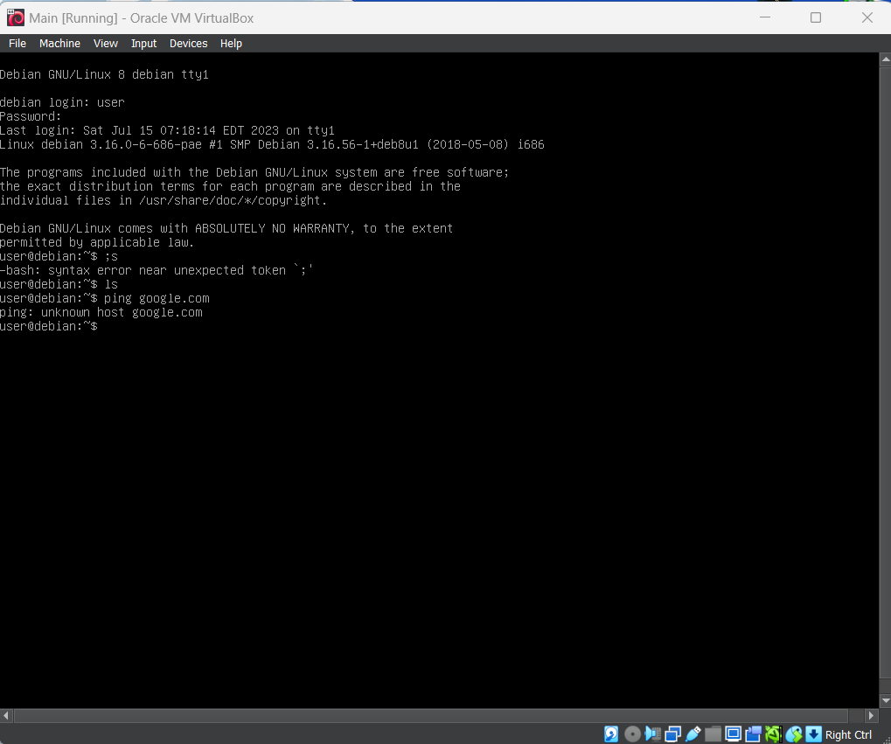

# Restore GRUB

## Tools Used

- Virtual Box
- Debian 12 standard live cd from https://cdimage.debian.org/debian-cd/current-live/amd64/iso-hybrid/

## Steps

This restoration use https://wiki.debian.org/GrubEFIReinstall as main reference.

- Load Main.Ova with Virtual Box
- Boot with Debian 12 live cd
- Step 1. Check the existence of `/sys/firmware/efi` folder. Result: it exist.
- Check if `/sys/firmware/efi/efivars` is exist. Result: it exist. We skip step 2.
- Step 3, mount the broken system. The EFI partition exist on /dev/sda1 and filesystem on /dev/sda2. Thus, we run

```bash
mount /dev/sda2 /mnt/
mount /dev/sda1 /mnt/boot/efi
```

- Step 4, run

```bash
for i in /dev /dev/pts /proc /sys /sys/firmware/efi/efivars /run; do sudo mount -B $i /mnt$i; done
```

- Step 5, chroot into broken system

```bash
chroot /mnt
```

- Step 6, reinstall grub

```bash
grub-install /dev/sda
```

- Step 7, generate GRUB configuration file

```bash
update-grub
```

- Reboot and remove live cd

Successfull restoration proof

