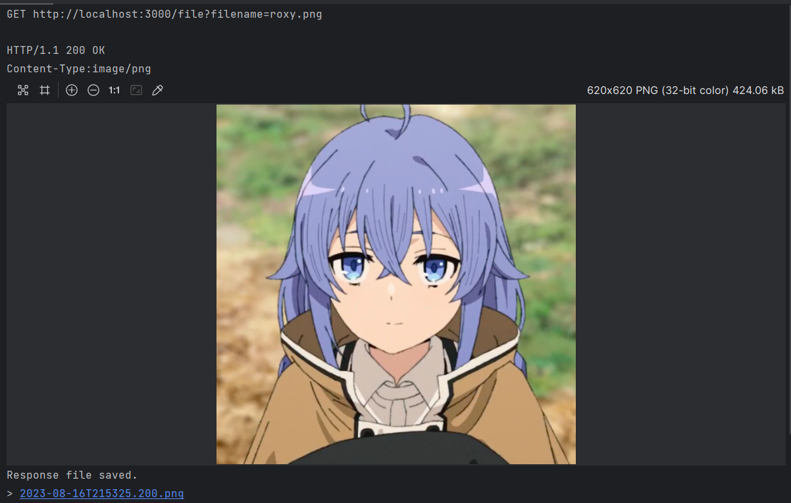

# Sister-TS

## Development Environment

- Node 18
- Ubuntu 22.04
- Webstorm

## How to Install

Install required package

`npm install`

Create database and storage folder

`mkdir database && mkdir storage`

Run dev

`npm run dev`

or build and run

`npm run build && npm run start`

## Library Implementation

This package was developed to imitate express-js library behaviour and use functional paradigm for program building.

Request and response timeline:

- Socket receive data. Parse request and create initial request and response data class
- Pass every request and data to every middleware function
- Find corresponding request handler and run. If not found, throw not found error
- If error occured, the error will be passed to every error middleware function

## Features

### HTTP Get Request that accept application/json

Request
```
GET http://localhost:3000
Accept: application/json
Connection: Keep-Alive
User-Agent: Apache-HttpClient/4.5.14 (Java/17.0.7)
Accept-Encoding: br,deflate,gzip,x-gzip
```

Response
```
HTTP/1.1 200 OK
Content-Type:application/json

{
  "message": "Hello world"
}
```

### HTTP Get Request that accept text/plain

Request
```
GET http://localhost:3000
Accept: text/plain
Connection: Keep-Alive
User-Agent: Apache-HttpClient/4.5.14 (Java/17.0.7)
Accept-Encoding: br,deflate,gzip,x-gzip
```

Response
```
HTTP/1.1 200 OK
Content-Type:text/plain

Hello world
```

### HTTP GET request with query param

Request
```
GET http://localhost:3000/todo?completed=true
Accept: application/json
Connection: Keep-Alive
User-Agent: Apache-HttpClient/4.5.14 (Java/17.0.7)
Accept-Encoding: br,deflate,gzip,x-gzip
```

Response
```
HTTP/1.1 200 OK
Content-Type:application/json

[
  {
    "id": 2,
    "title": "Anjay",
    "file": "roxy.png",
    "completed": 1
  }
]
```

### HTTP Post Request with multipart/form-data and image

Request
```
POST http://localhost:3000/todo
Content-Type: multipart/form-data; boundary=WebAppBoundary
Content-Length: 424362
Connection: Keep-Alive
User-Agent: Apache-HttpClient/4.5.14 (Java/17.0.7)
Accept-Encoding: br,deflate,gzip,x-gzip

--WebAppBoundary
Content-Disposition: form-data; name="title"
Content-Type: text/plain

Anjay
--WebAppBoundary
Content-Disposition: form-data; name="file"; filename="roxy.png"
Content-Type: image/png

< \\wsl$\Ubuntu-22.04\home\barcode\sister\repo\sister-js\test\roxy.png
--WebAppBoundary--
```

Response
```
HTTP/1.1 200 OK
Content-Type:application/json

{
  "message": "Created"
}
```

### HTTP PUT request with JSON body

Request
```
PUT http://localhost:3000/todo
Content-Type: application/json
Content-Length: 13
Connection: Keep-Alive
User-Agent: Apache-HttpClient/4.5.14 (Java/17.0.7)
Accept-Encoding: br,deflate,gzip,x-gzip

{
  "id": 2
}
```

Response
```
HTTP/1.1 200 OK
Content-Type:application/json

{
  "message": "Updated"
}
```

### HTTP DELETE request with url encoded body

Request
```
DELETE http://localhost:3000/todo
Content-Type: application/x-www-form-urlencoded
Content-Length: 4
Connection: Keep-Alive
User-Agent: Apache-HttpClient/4.5.14 (Java/17.0.7)
Accept-Encoding: br,deflate,gzip,x-gzip

id=2
```

Response
```
HTTP/1.1 200 OK
Content-Type:application/json

{
  "message": "Deleted"
}
```


### Serve File

Request
```
GET http://localhost:3000/file?filename=roxy.png
Connection: Keep-Alive
User-Agent: Apache-HttpClient/4.5.14 (Java/17.0.7)
Accept-Encoding: br,deflate,gzip,x-gzip
```

Response


### Middleware

Incoming request header logger. Sample:

```
==========BEGIN REQUEST LOGGER==========
HTTP Head
DELETE /todo
Query param
{}
Headers
content-type:application/x-www-form-urlencoded
content-length:4
host:localhost:3000
connection:Keep-Alive
user-agent:Apache-HttpClient/4.5.14 (Java/17.0.7)
accept-encoding:br,deflate,gzip,x-gzip
==========END REQUEST LOGGER==========
```

### Error Middleware

Program will throw any error and corresponding error middleware will handle it or pass it to next middleware. Example result for not found error handler

```
GET http://localhost:3000/asdasd

HTTP/1.1 404 Not Found

Response code: 404 (Not Found); Time: 517ms (517 ms); Content length: 2 bytes (2 B)
```

### Parallel Request Processing

Using node cluster module to create worker and node js will handle socket connection distribution.

Code could be read on `index.ts`

Run log

```
> sister-js@1.0.0 start
> node dist/index.js

Available CPU: 16, MAX: 2
Primary 31374 is running
Available CPU: 16, MAX: 2
Worker 31385 started
Server opened on  http://localhost:3000
Available CPU: 16, MAX: 2
Worker 31386 started
Server opened on  http://localhost:3000
```


## Bonus Checklist

- [x] base feature
- [x] handle middleware
- [x] parse multipart/form-data
- [x] custom JSON parser
- [x] handle file upload and send file response
- [x] parallelize request processing

## Reference

- https://www.rfc-editor.org/rfc/rfc7578
- https://developer.mozilla.org/en-US/docs/Web/HTTP/Methods/POST
- https://lihautan.com/json-parser-with-javascript/
- https://javascript.plainenglish.io/create-your-own-implementation-of-json-stringify-simiplied-version-8ab6746cdd1